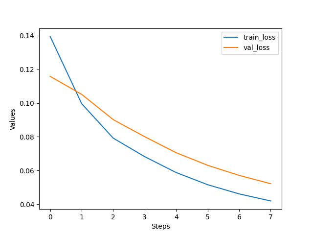
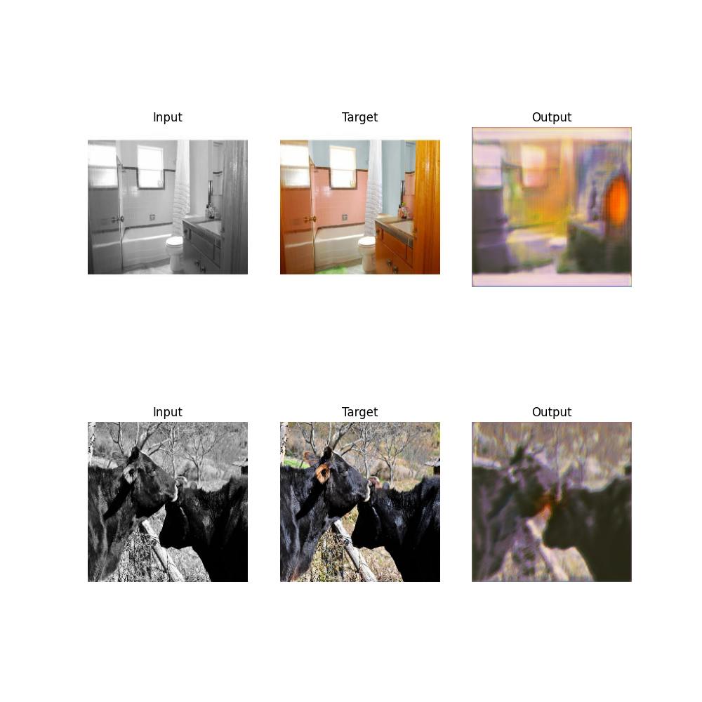

# Computer Vision Expirements i.e. `cv_expt`
This project is being done with the help of ChatGPT and CoPilot.

## Why are we doing it?
We were surprised when learning about the history of Neural Networks and one particular research I (Ramkrishna) like most about Neural Network comes from **Hornik, Stinchcombe, White 1989** about Existence Theorem (about Universal Approximation Theorem). It states that 3-layer neural nets can approximate any continuous function on a compact domain. Compact domain means input set has a finite diameter and the boundary is part of the input set.

But what about the complex tasks that we try to generalize on real world? And many more...


## Installation
1. `git clone https://github.com/Crazz-Zaac/computer-vision-experiments.git`
2. `pip install -e cv_expt -r requirements.txt`
3. Tada....

## Running Tests
1. `pip install pytest`
2. We recommend to use `VSCode` and select the tests folder.

## Developing
1. Install `black` for formatting.
2. Make sure to enable `format on saving` for VSCode.

## To Do
Order by priority!

* Make trainer as abstract as possible. And inherit it on each notebook.
* How to handle image/label pair in dataset?
* Handling model predict and postprocess.

## Directory Structure
<details>
<summary> Directory Structure</summary>

```
|── data
│   └── # Directory for storing raw and processed datasets.
├── setup.py
│   └── # Setup script for installing dependencies and setting up the project.
├── cv_expt
│   ├── base
│   │   ├── defs
│   │   │   └── configs.py
│   │   │       # Configuration definitions for experiments.
│   │   ├── data
│   │   │   └── base_dataset.py
│   │   │       # Base class for dataset handling and preprocessing.
│   │   ├── trainer
│   │   │   └── base_trainer.py
│   │   │       # Base class for training routines and loops.
│   │   ├── logger
│   │   │   └── base_logger.py
│   │   │       # Base class for logging experiment results - and metrics.
│   │   └── models
│   │       └── base_model.py
│   │           ├── Implements training and inference modes.
│   │           └── Contains input/output processing logic for models.
│   ├── vis
│   │   └── visualization.py
│   │       # Visualization utilities for experiment results.
│   ├── logger
│   │   ├── local_logger.py
│   │   │   # Logger for saving logs locally.
│   │   └── wandb_logger.py
│   │       # Logger for integrating with Weights & Biases (WandB).
│   └── experiment
│       └── experiment.py
│           # Script to define and run experiments.
├── notebooks
│   ├── expt1_name.ipynb
│   │   # Jupyter notebook for Experiment 1.
│   └── expt2_name.ipynb
│       # Jupyter notebook for Experiment 2.
├── assets
│   └── # Directory for storing images and files used in the README or documentation.
├── models
│   └── # Directory to store model weight files for logging and evaluation.
├── outputs
│   ├── # Directory for storing local outputs, not committed to the repository.
│   └── results
│       ├── expt1
│       │   ├── logs
│       │   │   └── run_logs.logs
│       │   │       # Log files for tracking the progress and results of Experiment 1.
│       │   ├── epoch_0.png
│       │   │   # Sample output image from the first epoch of Experiment 1.
│       │   └── best_model.pth
│       │       # The best-performing model checkpoint from Experiment 1.

```
</details>


## Experiments

<details>
<summary>Can U-Nets perform Grayscale to RGB?</summary>

- Please follow [Experiment Notebook](notebooks/grayscale_to_rgb.ipynb) to reproduce results.
- **Why is it relevant?**
    - U-Nets are powerful in semantic segmentation and they are a form of Auto-encoders. Auto-encoders are foundational models for VAE and GANs and can still be good start for an experiment. 

- **What our experiment showed?**
    - MSELoss: 
    
    - At Last Epoch:
    
- **Conclusions**
    - It worked!
</details>

<details>
<summary>Can U-Nets perform histogram equalization?</summary>

- **Why is it relevant?**
    - Histogram equalization can enhance the contrast of images, which might be useful for improving the quality of certain images or features.
- **What our experiment showed?**
    - 
    
- **Conclusions**
    - 

</details>

<details>
<summary>Can U-Nets perform image completion?</summary>

- **Why is it relevant?**
    - Image completion, or inpainting, is used to fill in missing parts of images, which can be useful in various applications such as restoration or data augmentation.
- **What our experiment showed?**
    - 
    
- **Conclusions**
    - 

</details>
